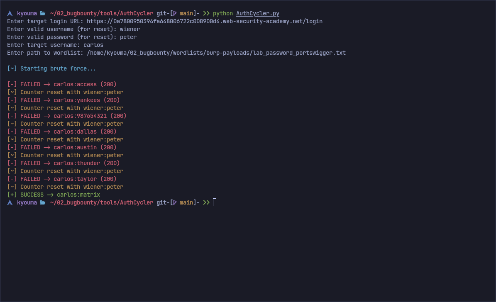

# AuthCycler 🚀


AuthCycler is a Python automation tool for ethical security testing.\
It automates login attempts for a target account while using a valid account to reset failed login counters, bypassing temporary IP blocks.

**⚠️ WARNING:** Only use for educational purposes or authorized penetration testing.

______________________________________________________________________

## Features ✨

- Brute-force automation with counter reset mechanism
- Colored terminal logs for clarity (Green=Success, Red=Failed, Yellow=Reset success, Magenta=Reset failed)
- Tab-completion for wordlist path input
- Interactive CLI prompts and optional command-line arguments
- Lightweight Python script using `requests` and `colorama`

______________________________________________________________________

## Demo Screenshot 🖥️



______________________________________________________________________

## Installation ⚙️

1. Clone the repository:

```bash
git clone https://github.com/username/AuthCycler.git
cd AuthCycler
```

2. Install dependencies:

```bash
pip install -r requirements.txt
```

______________________________________________________________________

## Usage 📝

### Interactive Mode

```bash
python AuthCycler.py
```

Follow the prompts:

1. Enter target login URL
1. Enter valid account username & password (for counter reset)
1. Enter target username
1. Enter path to your wordlist (supports tab-completion)

### CLI Arguments Mode

```bash
python AuthCycler.py \
  --url https://example.com/login \
  --valid-user wiener \
  --valid-pass peter \
  --target carlos \
  --wordlist ~/wordlists/lab_password.txt
```

______________________________________________________________________

## Terminal Log Colors 🌈

- ✅ Green → Successful login
- ❌ Red → Failed login
- 🌟 Yellow → Counter reset successful
- ⚠️ Magenta → Counter reset failed

______________________________________________________________________

## Contributing 🤝

Contributions, issues, and pull requests are welcome.
Remember: **use responsibly for authorized testing or education only.**

______________________________________________________________________

## License 🛡️

This project is licensed under the MIT License.
